# pythonanywhere에 챗봇 배포하기!

### 0. 체크리스트

> pythonanywhere에서 무료계정을 사용할때 제약사항
>
> 1. 외부 요청에 대하여 whitelist 처리가 되어 허용되지 않은 사이트로 요청 불가
> 2. Database를 MySQL만 사용가능

- 플라스크 어플리케이션이 정상작동 하는지 확인
- [pythonanywhere](https://www.pythonanywhere.com) 가입


### 1. web app 만들기

- 로그인


- `web apps` 클릭

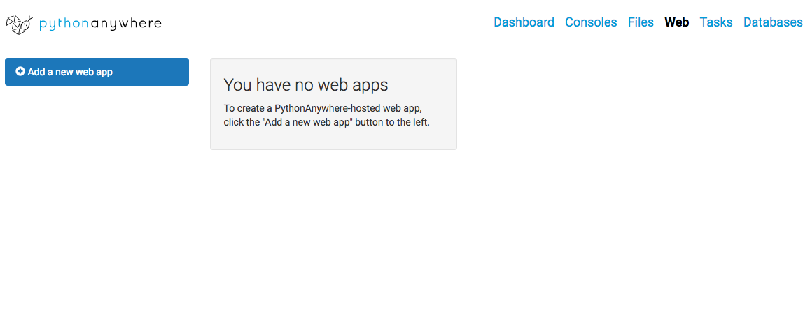

- `Add a new web app`

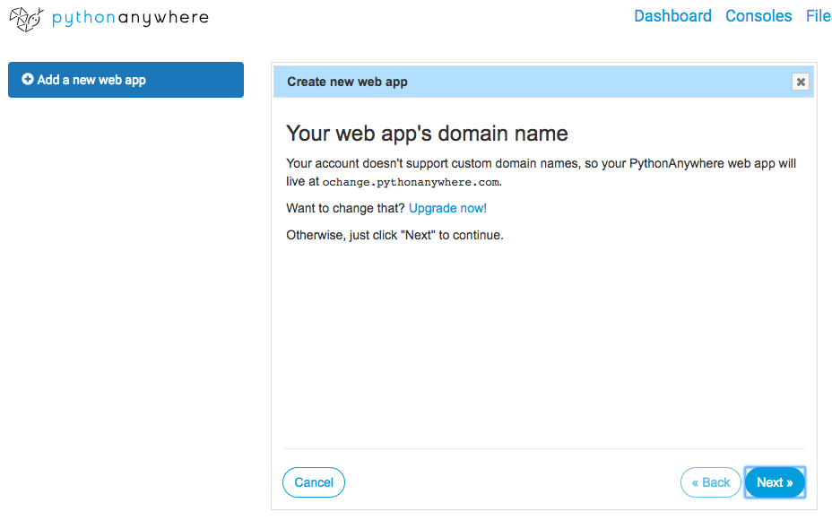

- `next`

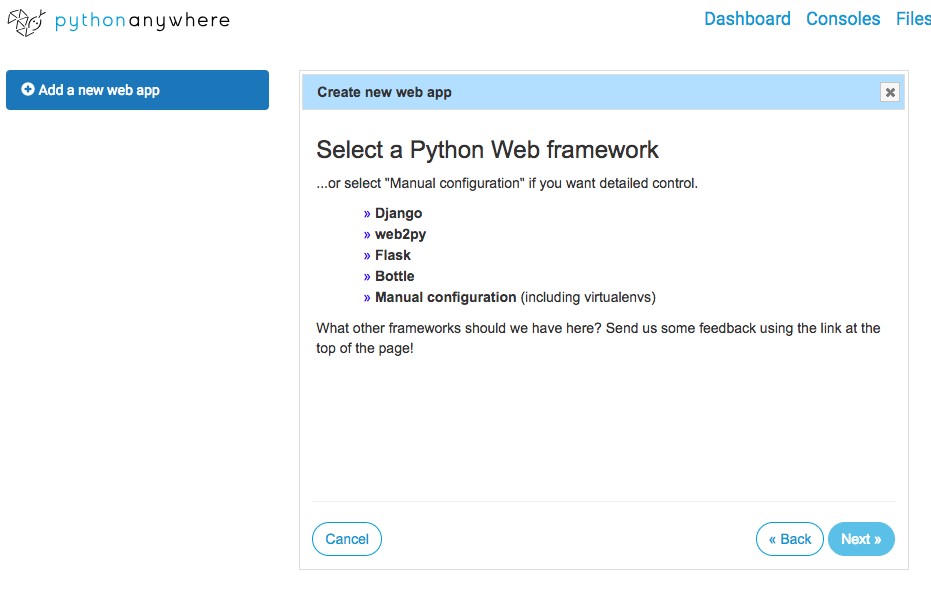

- `Flask` 선택

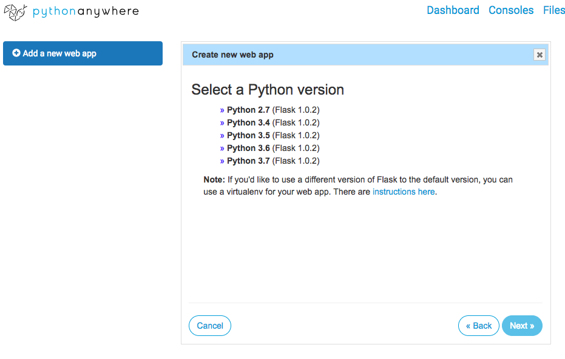

- `Python 3.6`

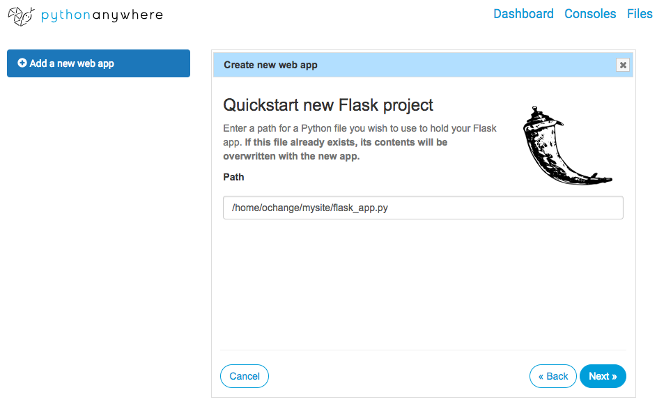

- `flask_app.py` => `app.py`로 수정

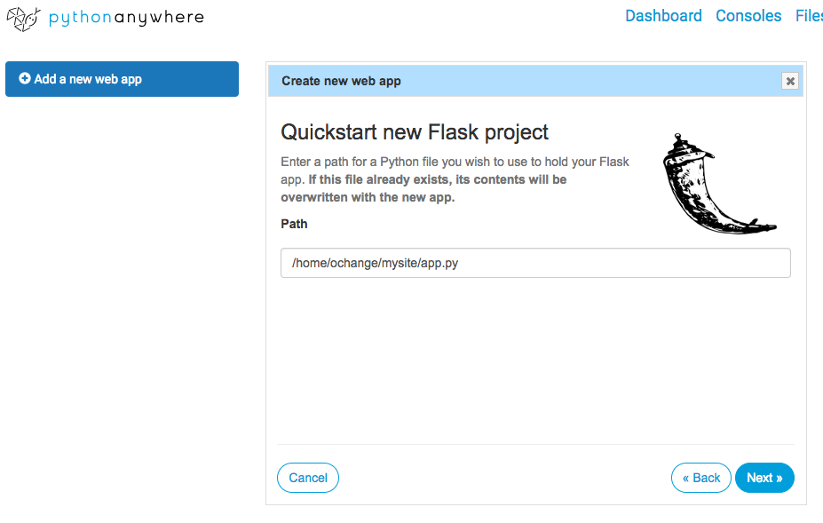


### 2. DB 설정

> pythonanywhere 무료서비스에서는 database를 MySQL만 지원한다.
>
> 따라서 수업을 진행할때 사용했던 Postgres 설정을 MySQL설정으로 바꿔준다.

- C9에서 작성한 기존 코드를 수정하고 이동!!
- `MySQL`에서는 String 형식의 길이를 정해줘야 한다. 따라서 다음의 코드와 같이 필요한 길이 만큼의 숫자를 인자로 넣어준다.

```python
class Movie(db.Model):
    __tablename__ = 'movies'
    id = db.Column(db.Integer, primary_key=True)
    # 상대적으로 짧은 길이를 저장하는 title은 32로
    title = db.Column(db.String(32))
    star = db.Column(db.Float)
    # img url은 긴 문자열이 담기기 때문에 큰값으로 설정!
    img = db.Column(db.String(256))

    def __init__(self,title,star,img):
        self.title = title
        self.star = star
        self.img = img
```

- `pythonanywhere`에서  `Databases`탭으로 들어가 비밀번호를 설정한다.
  계정의 비밀번호와 다르게 설정!! 파이썬 코드에 들어갈 DB 비밀번호!!

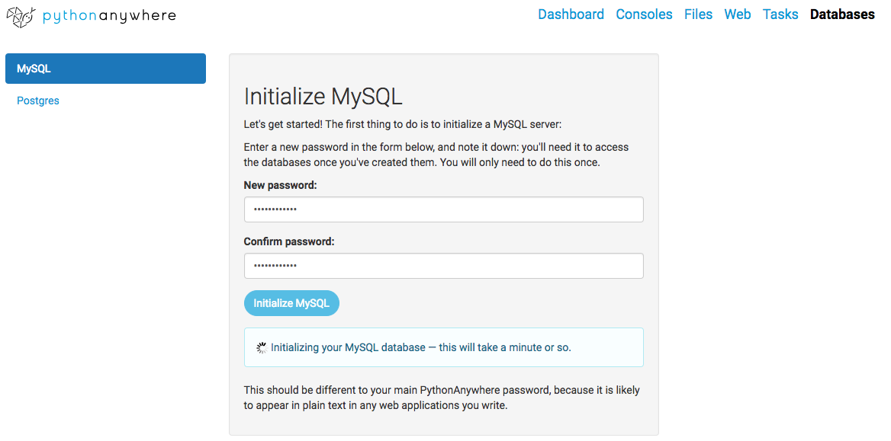

- 생성된 MySQL 정보 확인

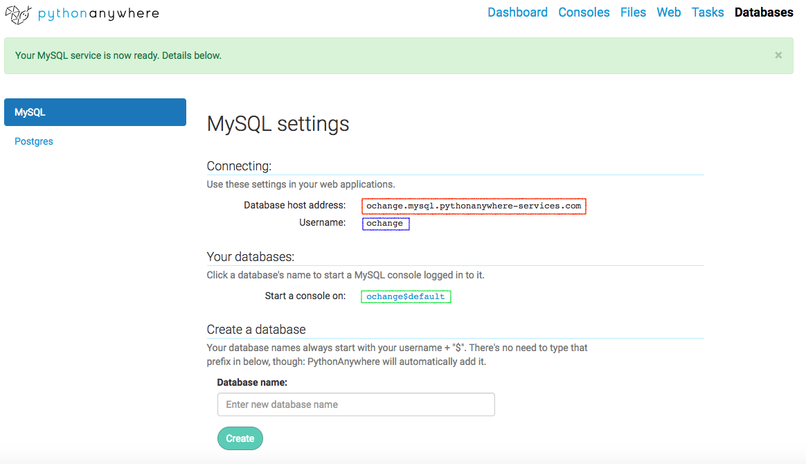

- `app.py`설정
  기존의 postgre 설정을 MySQL 주소로 변경

```python
#app.config["SQLALCHEMY_DATABASE_URI"] = 'postgresql:///movie'
SQLALCHEMY_DATABASE_URI = "mysql+mysqlconnector://{username}:{password}@{hostname}/{databasename}".format(
    username="ochange", # 위 사진의 파란색 영역값
    password="change0725", # MySQL 설정 초반의 비밀번호
    hostname="ochange.mysql.pythonanywhere-services.com", # 위 사진의 빨간색 영역값
    databasename="ochange$default", # 위 사진의 초록색 영역값
)

app.config["SQLALCHEMY_DATABASE_URI"] = SQLALCHEMY_DATABASE_URI
app.config["SQLALCHEMY_TRACK_MODIFICATION"] = False
db.init_app(app)
```

- `github`에 올리기!


### 3. 서버로 코드 가져오기

- 
  아래 사진의 왼쪽 하단의 `$Bash` 버튼으로 콘솔창 진입

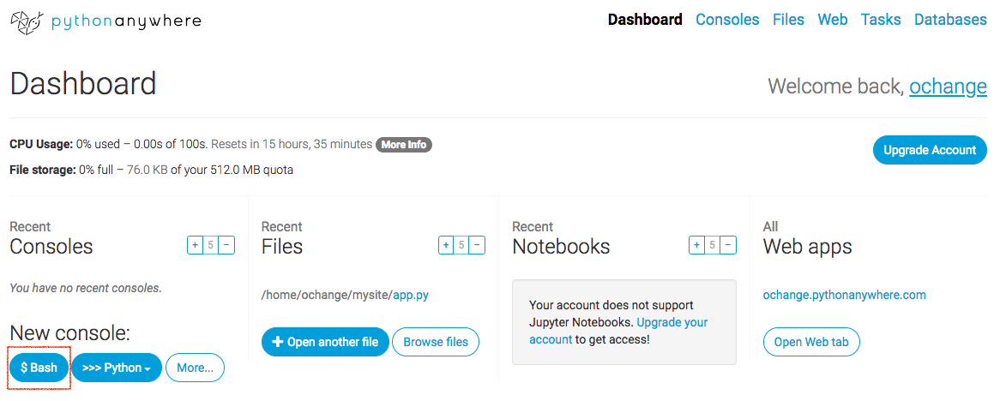

- `github`에 올린 코드를 콘솔을 통해 clone

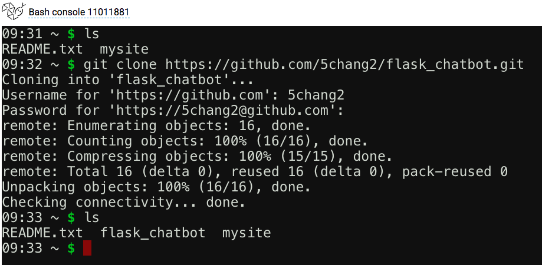

- webapp설정 파트에서 mysite의 app.py를 찾도록 설정하였기 때문에 폴더 이름을 변경
  기존의 `mysite`를 `temp`로 clone해서 가져온 프로젝트 폴더를 `mysite`로 변경

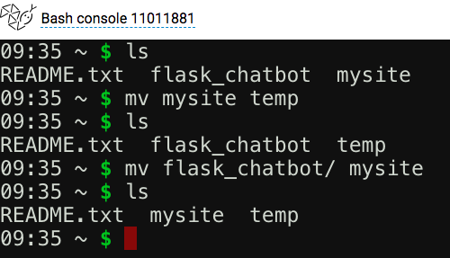

### 4. 마이그레이션 작업

- `github`에 올린 폴더에 기존의 Postgresql에 적용한 마이그레이션 폴더가 있기 때문에 삭제해준다.

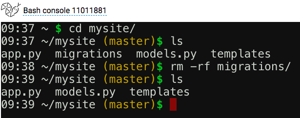

- 마이그레이션 작업을 위해 필요한 모듈을 설치해준다.
  pythonanywhere에서는 sudo 권한을 사용할 수 없기 때문에 user권한으로 설치한다.

```bash
pip3 install --user Flask-sqlalchemy flask-migrate
```

- `flask db init`

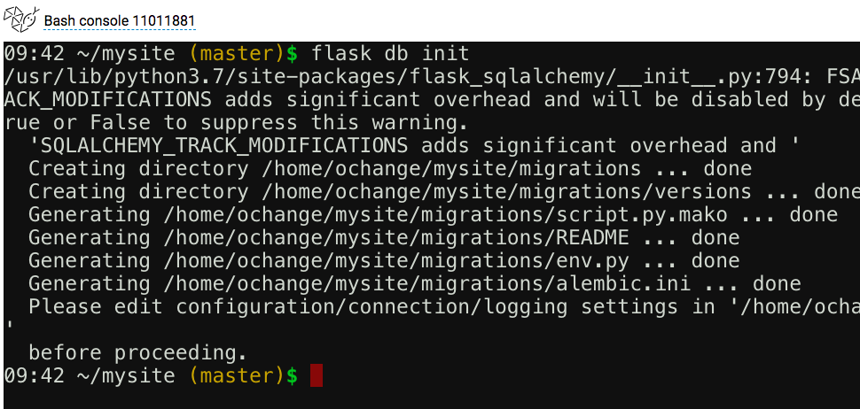

- `flask db migrate`

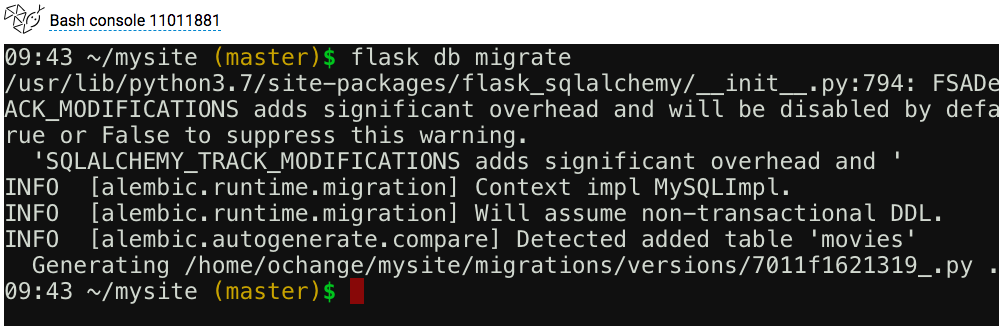

- `flask db upgrade`

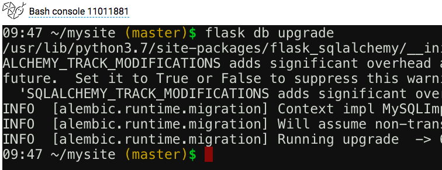

- **[필수]** `app.py` 수정
  마이그레이션 작업을 진행할때 필요한 `flask_migrate`모듈을 서버를 실행할때는 못불러 오는 문제가 생겨 마이그레이션 작업 후에 아래의 두줄을 **주석** 처리를 해준다.

```python
from flask_migrate import Migrate
migrate = Migrate(app,db)
```

### 5. 서버 리로드 및 카카오 플러스친구 URL설정

- Web탭의 초록색 Reload 버튼을 누르고 `<계정아이디>.pythonanywhere.com`으로 접속 후 서버 확인

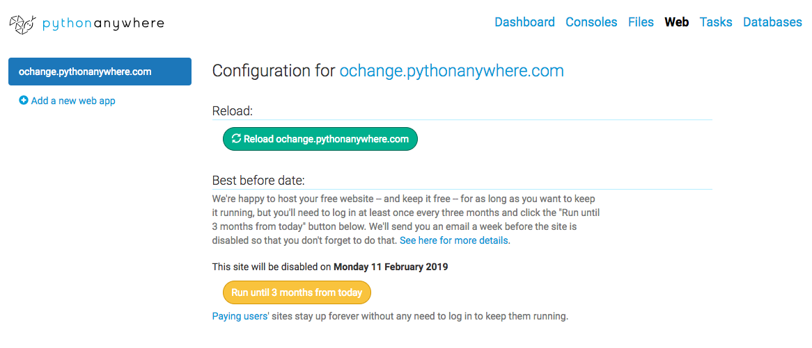

- 플러스 친구 관리자센터로 들어가 스마트 채팅의 API형 URL 주소를 위의 주소로 바꿔주면 끝!!!!