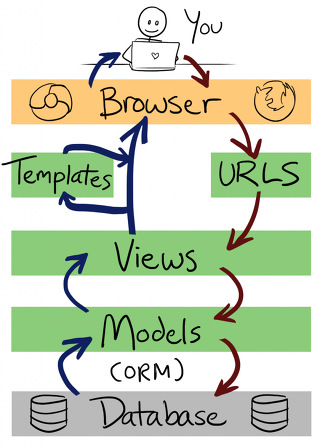

# django-crud with Form



### 프로젝트 이름 : board

### 앱 이름 : post

### 0. 프로젝트 폴더 구성

1. `django-admin`을 사용해서 프로젝트 생성
   1. `django-admin startproject board`
2. 프로젝트 폴더로 이동
   1. `cd board`
3. `django-admin`을 사용해서 앱 생성
   1. `django-admin startapp post`
4. 파이썬 로컬 환경설정을 위해 새로운 가상환경 생성
   1. `pyenv virtualenv 3.6.1 board`
5. 로컬로 파이썬 가상환경 설정
   1. `pyenv local board`
6. 로컬 가상환경에 장고 설치
   1. `pip install django`

### 1. 서버 실행

- 서버 실행 명령어
  - `python manage.py runserver $IP:$PORT`
  - 장고에서는 호스트 이름이 등록되지 않으면 접속을 못하게 막기 때문에
- `settings.py`를 수정

```python
# 이부분에 url을 추가해준다.
ALLOWED_HOSTS = ['django-project-ochange.c9users.io']
```


### 2. 모델 설정

- `models.py` 에 모델 정의

```python
from django.db import models

# Create your models here.
class Post(models.Model):
    title = models.CharField(max_length=50)
    content = models.CharField(max_length=100)
    
    def __str__(self):
        return self.title
```

- 마이그레이션 작업

  - 마이그레이션 작업을 하기 위해서는 `settings.py`에 앱을 추가 해줘야 합니다.

  ```python
  INSTALLED_APPS = [
      'django.contrib.admin',
      'django.contrib.auth',
      'django.contrib.contenttypes',
      'django.contrib.sessions',
      'django.contrib.messages',
      'django.contrib.staticfiles',
      'post',
  ]
  ```

  - `python manage.py makemogrations`
    - 설계도 작성
  - `python manage.py migrate`
    - 실제 db에 반영

- `admin.py`에 모델 추가

```python
from django.contrib import admin
# 현재폴더에 있는 models.py 에서 Post를 추가
from .models import Post
# 관리자 페이지에 Post 추가
admin.site.register(Post)
```

- admin페이지에서 확인을 위해 superuser 생성
  -  `python manage.py createsuperuser`


